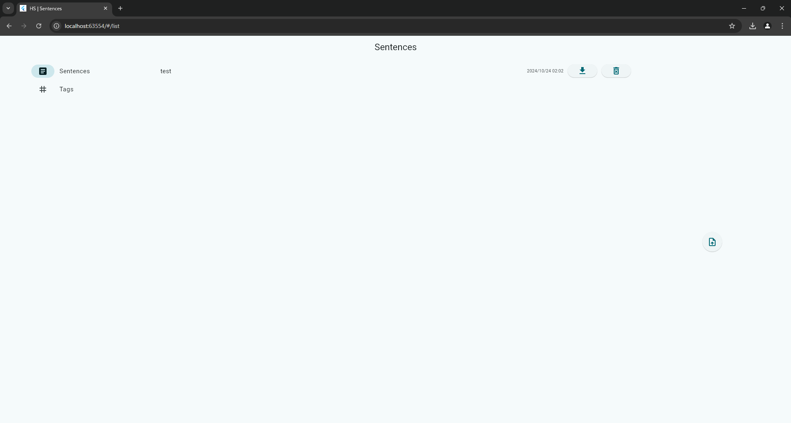

# HS

## 準備
### DB のテーブル作成
1. ./hs/server に移動する
2. psql を起動する
3. 下記コマンドを実行する
```
# \i ./sql/bulk.sh
```
### server 起動
4. ./hs/server に移動する
5. 下記コマンドを実行する
```
> go run main.go
```
### client 起動
6. ./hs/client に移動する
7. 下記コマンドを実行する
```
> flutter run -d chrome
```

## 使い方

<br>
画面右のボタンを押下するとファイル選択ポップアップが現れます。  
任意のテキストファイルを選択し、「開く」ボタンを押下します。  
<br>
整形済みの文章が表示されます。  
<br>
テキストの背景色を変える場合は、変更したい文を選択し、  
<br>
画面右側のタグボタンのいずれかを押下します。  
<br>
「Sentences」タブでは文章の登録、  
<br>
ダウンロード(Markdown 形式)、  
<br>
削除が行えます。  
<br>
<br>
「Tgas」タブではタグ名の変更が行えます。